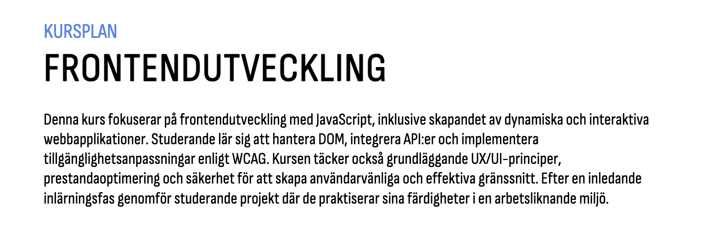

# Kursplaneringsprojekt

Detta projekt handlar om att skapa en digital kursplaneringsplattform med ett interaktivt och visuellt upplägg för att representera lärandemål, kunskap och färdigheter.

---

## 🎨 Designer

### Huvudstruktur
- **H1 + Header:** En tydlig rubrik och en introduktionssektion direkt under headern.
- **Introduktionsbild:**  
  

## 🎨 Färgpalett 

### 🎨 Color Palette

`#c8b158` `#fe7791` `#f08e84` `#afd85f` `#c989d1`  
`#4b64fd` `#ffbe6a` `#6fc3e5` `#64928e` `#c989d1`

---

## Typsnitt
- **Rubrik:** din-condensed 
- **Brödtext:** din regular

## Målgrupp 
Studenter
---

## 🎯 Lärandemål

### Kunskap + Färdighet
- Presenteras som en **mindmap** med olika bilder och ikoner kopplade till rubriker.
- Varje kort visar en **rubrik** (t.ex. “Javasscript”, “UX”).
- När man **klickar eller vänder** på ett kort:
  - Kortet **animeras** och **vänder sig**.
  - Kortet **blir större** och visar **förklarande text**.

---

