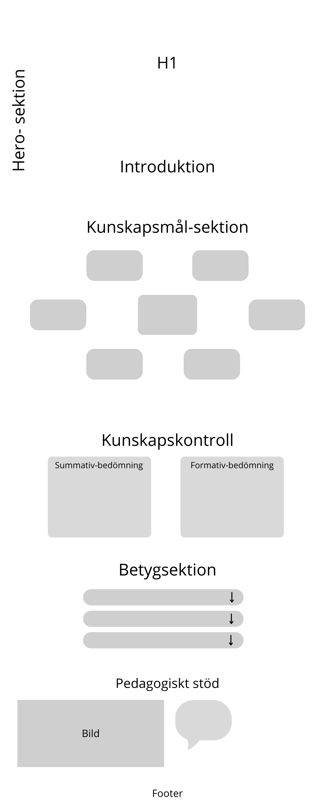
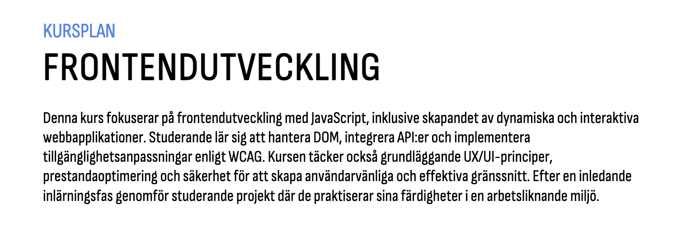
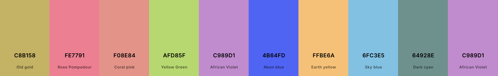

# Kursplaneringsprojekt

Detta projekt handlar om att skapa en digital kursplaneringsplattform med ett interaktivt och visuellt upplägg för att representera lärandemål, kunskap och färdigheter.

---

## Struktur

## One Page 
- **H1 + Header:** En tydlig rubrik och en introduktionssektion direkt under headern.
- **Introduktionsbild:**  
  

### Lärandemål: Kunskap + Färdighet
- Presenteras som en **mindmap** med olika bilder och ikoner kopplade till rubriker.
- Varje kort visar en **rubrik** (t.ex. “Javasscript”, “UX”).
- När man **klickar eller vänder** på ett kort:
  - Kortet **animeras** och **vänder sig**.
  - Kortet **blir större** och visar **förklarande text**.

### Kunskapskontroll

Sektionen "Kunskapskontroll" på hemsidan visar hur studerandes kunskaper utvärderas. Den innehåller två boxar:

- **Summativ bedömning** – Beskriver den bedömning.
- **Formativ bedömning** – Beskriver den löpande bedömning.

### Principer för bedömning och betygskriterier

Denna sektion på hemsidan innehåller flera boxar med olika rubriker som visar betygskriterier. Varje box har en pilner som användaren kan klicka på för att visa en mer detaljerad förklaring.  

Exempel på boxar:  
- **Icke godkänt (IG)**  
- **Godkänt (G)**  
- **Väl godkänt (VG)** 

### Rätt till särskilt pedagogiskt stöd och komplettering

Denna sektion på hemsidan innehåller en **bild med texten "Behöver du hjälp med detta?"** och en **knapp** som leder till en sida med mer information.  

---

## Designer

### Färgpalett 

`#c8b158` `#fe7791` `#f08e84` `#afd85f` `#c989d1`  
`#4b64fd` `#ffbe6a` `#6fc3e5` `#64928e` `#c989d1`

### Typsnitt
- **Rubrik:** din-condensed 
- **Brödtext:** din regular

### Målgrupp 
- **målgrupp** Studenter
---

### Länkmedtext till mindmapp 
- https://docs.google.com/document/d/1T9Kl1NSehktstvPBFwrg8Tx5TfBtG8UBY7e-fyvmgKk/edit?tab=t.0